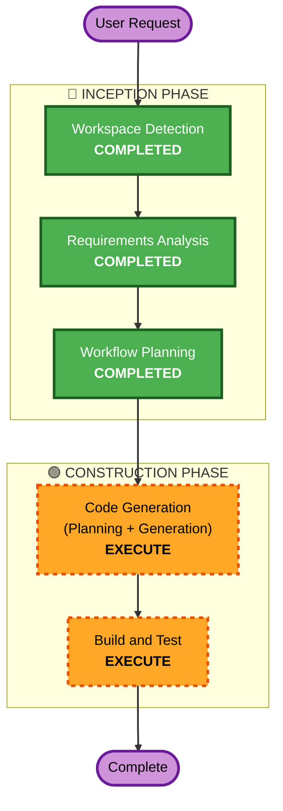

# Execution Plan

## Detailed Analysis Summary

### Change Impact Assessment
- **User-facing changes**: Sim — Sistema operacional completo para uso diário
- **Structural changes**: Sim — Projeto greenfield com estrutura de flake multi-host
- **Data model changes**: Não — Sem banco de dados
- **API changes**: Não — Sem APIs
- **NFR impact**: Sim — Segurança (LUKS, firewall, hardening), testabilidade (runNixOSTest)

### Risk Assessment
- **Risk Level**: Medium (múltiplos módulos, hardware específico, mas rollback via NixOS generations)
- **Rollback Complexity**: Easy (NixOS generations permitem rollback trivial)
- **Testing Complexity**: Moderate (testes em VM via runNixOSTest, hardware real não testável em VM)

## Workflow Visualization



### Text Alternative
```
Phase 1: INCEPTION
  - Workspace Detection (COMPLETED)
  - Requirements Analysis (COMPLETED)
  - Workflow Planning (COMPLETED)
  - Reverse Engineering (SKIP - Greenfield)
  - User Stories (SKIP - Infra/OS config, not user-facing app)
  - Application Design (SKIP - No business logic or service layer)
  - Units Generation (SKIP - Single unit of work)

Phase 2: CONSTRUCTION
  - Functional Design (SKIP - No complex business logic)
  - NFR Requirements (SKIP - NFRs already captured in requirements)
  - NFR Design (SKIP - No NFR patterns beyond what NixOS provides natively)
  - Infrastructure Design (SKIP - NixOS IS the infrastructure, not separate)
  - Code Generation (EXECUTE - Planning + Generation)
  - Build and Test (EXECUTE - Build instructions + test execution)

Phase 3: OPERATIONS
  - Operations (PLACEHOLDER - Future)
```

## Phases to Execute

### 🔵 INCEPTION PHASE
- [x] Workspace Detection (COMPLETED)
- [x] Reverse Engineering — SKIP
  - **Rationale**: Greenfield project, no existing code
- [x] Requirements Analysis (COMPLETED)
- [x] User Stories — SKIP
  - **Rationale**: Infrastructure/OS configuration project, not a user-facing application. No user personas or acceptance criteria needed beyond functional verification via tests.
- [x] Workflow Planning (COMPLETED)
- [x] Application Design — SKIP
  - **Rationale**: No application business logic, service layer, or component methods to design. NixOS modules are declarative configurations, not application code.
- [x] Units Generation — SKIP
  - **Rationale**: Single unit of work. Both hosts share most modules and the project is cohesive enough to implement as one unit.

### 🟢 CONSTRUCTION PHASE
- [x] Functional Design — SKIP
  - **Rationale**: No complex business logic or data models. NixOS module options are well-defined by the NixOS module system.
- [x] NFR Requirements — SKIP
  - **Rationale**: NFRs (security, testability, reproducibility) already fully captured in requirements document.
- [x] NFR Design — SKIP
  - **Rationale**: No NFR patterns to design beyond what NixOS provides natively (declarative config, atomic upgrades, rollback).
- [x] Infrastructure Design — SKIP
  - **Rationale**: NixOS configuration IS the infrastructure. There is no separate infrastructure layer to design.
- [ ] Code Generation — EXECUTE (ALWAYS)
  - **Rationale**: All Nix code (flake.nix, modules, host configs, tests) needs to be generated.
- [ ] Build and Test — EXECUTE (ALWAYS)
  - **Rationale**: Build verification and test execution instructions needed.

### 🟡 OPERATIONS PHASE
- [ ] Operations — PLACEHOLDER
  - **Rationale**: Future deployment and monitoring workflows

## Success Criteria
- **Primary Goal**: Configuração NixOS funcional para ambas as máquinas (Nobita e Doraemon)
- **Key Deliverables**:
  - flake.nix com inputs (nixpkgs-unstable, home-manager, catppuccin/nix)
  - Configuração por host (Nobita desktop, Doraemon notebook)
  - Módulos compartilhados (common, desktop, hardware, security, services)
  - Home Manager para usuário terabytes
  - Testes com runNixOSTest cobrindo serviços críticos
- **Quality Gates**:
  - `nix flake check` passa sem erros
  - Todos os testes runNixOSTest passam
  - Security Baseline rules aplicáveis estão em conformidade
  - PBT (partial) rules aplicáveis estão em conformidade
