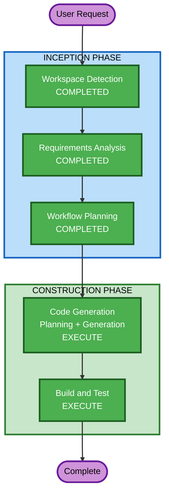

# Execution Plan — Integração Neovim

## Detailed Analysis Summary

### Transformation Scope
- **Transformation Type**: Single component addition (new Home Manager module)
- **Primary Changes**: New `home/neovim/` directory with Nix module + Lua config files
- **Related Components**: `home/default.nix` (add import), `home.packages` (cleanup redundant packages)

### Change Impact Assessment
- **User-facing changes**: Yes — novo editor configurado com LSPs e plugins
- **Structural changes**: No — adiciona módulo dentro da estrutura existente
- **Data model changes**: No
- **API changes**: No
- **NFR impact**: No — não afeta performance/segurança do sistema

### Risk Assessment
- **Risk Level**: Low (módulo isolado, fácil rollback via NixOS generations)
- **Rollback Complexity**: Easy (remover import do home/default.nix)
- **Testing Complexity**: Moderate (múltiplos LSPs e formatadores para verificar)

## Workflow Visualization



### Text Alternative
```
INCEPTION PHASE:
  1. Workspace Detection — COMPLETED
  2. Requirements Analysis — COMPLETED
  3. Workflow Planning — COMPLETED (current)

CONSTRUCTION PHASE:
  4. Code Generation (Planning + Generation) — EXECUTE
  5. Build and Test — EXECUTE
```

## Phases to Execute

### INCEPTION PHASE
- [x] Workspace Detection (COMPLETED) — Brownfield, módulo existente
- [x] Reverse Engineering — SKIP (novo módulo, sem código legado para analisar)
- [x] Requirements Analysis (COMPLETED) — 10 requisitos funcionais documentados
- [x] User Stories — SKIP (projeto infra/OS, sem user personas)
- [x] Workflow Planning (COMPLETED) — Este documento
- [x] Application Design — SKIP (sem business logic, sem componentes de serviço)
- [x] Units Generation — SKIP (unidade única: home/neovim/)

### CONSTRUCTION PHASE
- [x] Functional Design — SKIP (sem business logic complexa)
- [x] NFR Requirements — SKIP (capturados nos requisitos, Nix provê nativamente)
- [x] NFR Design — SKIP (NixOS garante reprodutibilidade/imutabilidade nativamente)
- [x] Infrastructure Design — SKIP (NixOS É a infraestrutura)
- [ ] Code Generation — EXECUTE
  - **Rationale**: Implementação do módulo Nix + configurações Lua necessária
  - **Part 1**: Plano detalhado com checkboxes
  - **Part 2**: Geração de código seguindo o plano
- [ ] Build and Test — EXECUTE
  - **Rationale**: Verificação com nix flake check + runNixOSTest

### OPERATIONS PHASE
- [ ] Operations — PLACEHOLDER

## Estimated Timeline
- **Total Stages to Execute**: 2 (Code Generation + Build and Test)
- **Total Stages to Skip**: 9
- **Estimated Files**: ~20 (1 Nix module + 16 Lua configs + 1 test + imports update)

## Success Criteria
- **Primary Goal**: Neovim funcional com 8 LSPs, 8 formatadores, 16 plugins, tema Catppuccin
- **Key Deliverables**:
  - `home/neovim/default.nix` com plugins, extraPackages, initLua
  - 16 arquivos Lua de configuração em `home/neovim/config/`
  - Teste runNixOSTest para validar setup completo
  - Import adicionado em `home/default.nix`
- **Quality Gates**:
  - `nix flake check` passa sem erros
  - Teste Neovim: todos LSPs respondem, formatadores disponíveis, parsers carregam
