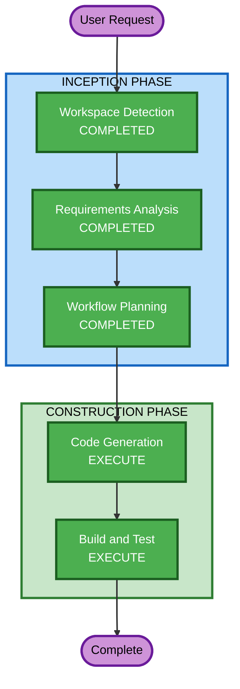

# Execution Plan — QuickShell GitHub Session

## Detailed Analysis Summary

### Change Impact Assessment
- **User-facing changes**: Yes — novo painel visual no QuickShell
- **Structural changes**: No — adiciona novo módulo QML sem alterar existentes
- **Data model changes**: No — apenas parsing de JSON do `gh` CLI
- **API changes**: No — consome API existente do GitHub via `gh`
- **NFR impact**: No — Timer de 1h, impacto negligível

### Risk Assessment
- **Risk Level**: Low
- **Rollback Complexity**: Easy (remover import + pasta github/)
- **Testing Complexity**: Simple (verificar que QML carrega sem erro)

## Workflow Visualization



### Text Alternative
```
INCEPTION PHASE:
  1. Workspace Detection — COMPLETED
  2. Requirements Analysis — COMPLETED
  3. Workflow Planning — COMPLETED

CONSTRUCTION PHASE:
  4. Code Generation (Planning + Generation) — EXECUTE
  5. Build and Test — EXECUTE
```

## Phases to Execute

### INCEPTION PHASE
- [x] Workspace Detection (COMPLETED)
- [x] Reverse Engineering — SKIP (brownfield, nova feature isolada)
- [x] Requirements Analysis (COMPLETED)
- [x] User Stories — SKIP (painel UI simples, sem personas)
- [x] Workflow Planning (COMPLETED)
- [x] Application Design — SKIP (não há novos componentes de backend)
- [x] Units Generation — SKIP (unidade única)

### CONSTRUCTION PHASE
- [x] Functional Design — SKIP (sem lógica de negócio, apenas UI + shell commands)
- [x] NFR Requirements — SKIP (já capturado nos requisitos: timer 1h, resiliência)
- [x] NFR Design — SKIP (QuickShell/QML não requer patterns NFR separados)
- [x] Infrastructure Design — SKIP (sem infra, é um painel QML local)
- [ ] Code Generation — EXECUTE
  - **Rationale**: Gerar 3 QML files + atualizar shell.qml (import + componente)
- [ ] Build and Test — EXECUTE
  - **Rationale**: Validar que nix flake check passa e gerar instruções de teste

### OPERATIONS PHASE
- [ ] Operations — PLACEHOLDER

## Estimated Timeline
- **Total Stages to Execute**: 2 (Code Generation + Build and Test)
- **Estimated Files**: ~5 (3 QML novos + 1 shell.qml modificado + 1 Nix atualização se necessário)

## Success Criteria
- **Primary Goal**: Painel GitHub funcional no QuickShell exibindo notificações e repos
- **Key Deliverables**: GitHubPanel.qml, GitHubDataManager.qml, RepoCard.qml, shell.qml atualizado
- **Quality Gates**: nix flake check passa, QML sem erros de parsing
